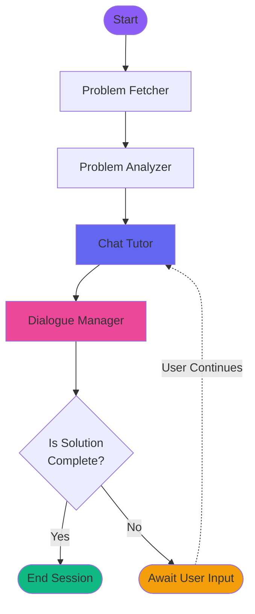
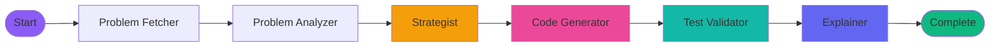

# Forcio AI - Graph Flow Documentation

This document provides a comprehensive overview of the two operational modes in Forcio AI: **Study Mode** and **Power Mode**. Each mode is implemented as a directed graph using LangGraph, with specialized agents working together to deliver unique learning experiences.

---

## 📊 Overview

Forcio AI operates in two distinct modes:

- **Study Mode**: Interactive, chat-based tutoring that adapts to user understanding
- **Power Mode**: Autonomous solution generation pipeline with instant results

---

## 🎓 Study Mode Graph

### Purpose

Study Mode provides an interactive learning experience where users can ask questions, receive hints, and learn problem-solving strategies at their own pace.

### Flow Diagram



### Node Details

#### 1. **Problem Fetcher**

- **Role**: Retrieves problem data from LeetCode API
- **Input**: Problem name from user
- **Output**:
  - Problem statement
  - Examples with inputs/outputs
  - Constraints
  - Difficulty level

#### 2. **Problem Analyzer**

- **Role**: Analyzes problem characteristics and patterns
- **Input**: Raw problem data
- **Output**:
  - Problem category (array, tree, graph, etc.)
  - Key patterns identified
  - Complexity considerations
  - Related topics

#### 3. **Chat Tutor**

- **Role**: Provides interactive tutoring based on user questions
- **Input**:
  - Conversation history
  - User's current code
  - Understanding level
- **Output**:
  - Contextual responses
  - Hints and guidance
  - Code suggestions
  - Educational explanations

#### 4. **Dialogue Manager**

- **Role**: Manages conversation flow and completion status
- **Input**: Current conversation state
- **Output**:
  - Determines if solution is complete
  - Signals when awaiting user input
  - Tracks learning progress

### State Management

```typescript
interface StudyState {
  mode: "study";
  problemName: string;
  problemStatement: string;
  examples: Example[];
  constraints: string[];

  // Study-specific
  conversationHistory: ConversationEntry[];
  userCode: string;
  userUnderstandingLevel: "beginner" | "intermediate" | "advanced";
  topicsCovered: string[];
  userQuestions: string[];
  isSolutionComplete: boolean;
  awaitingUserInput: boolean;
}
```

### Key Features

- ✅ Interactive chat-based learning
- ✅ Adaptive to user's understanding level
- ✅ Conversational history tracking
- ✅ Progress monitoring
- ✅ Non-linear learning path

---

## ⚡ Power Mode Graph

### Purpose

Power Mode is an autonomous pipeline that instantly generates optimized solutions with multiple strategies, validation, and comprehensive explanations.

### Flow Diagram



### Node Details

#### 1. **Problem Fetcher**

- **Role**: Retrieves problem data from LeetCode API
- **Input**: Problem name from user
- **Output**: Same as Study Mode
  - Problem statement
  - Examples with inputs/outputs
  - Constraints
  - Difficulty level

#### 2. **Problem Analyzer**

- **Role**: Deep analysis of problem characteristics
- **Input**: Raw problem data
- **Output**:
  - Problem category and patterns
  - Optimal approach recommendations
  - Complexity requirements

#### 3. **Strategist**

- **Role**: Generates multiple solution strategies
- **Input**: Analyzed problem data
- **Output**:
  - Multiple strategies with pros/cons
  - Time/space complexity for each
  - Recommended optimal approach
  - Strategy comparison matrix

#### 4. **Code Generator**

- **Role**: Generates optimized code for selected strategy
- **Input**:
  - Selected strategy
  - Problem requirements
  - Target language
- **Output**:
  - Clean, optimized code
  - Inline comments
  - Edge case handling

#### 5. **Test Validator**

- **Role**: Validates generated code against test cases
- **Input**:
  - Generated code
  - Example test cases
- **Output**:
  - Test results (passed/failed)
  - Feedback on failures
  - Edge case validation

#### 6. **Explainer**

- **Role**: Provides comprehensive solution explanation
- **Input**:
  - Validated code
  - Strategy used
- **Output**:
  - Step-by-step explanation
  - Complexity analysis
  - Code walkthrough
  - Key insights

### State Management

```typescript
interface PowerState {
  mode: "power";
  problemName: string;
  problemStatement: string;
  examples: Example[];
  constraints: string[];

  // Power-specific
  strategies: Strategy[];
  selectedStrategy: Strategy | null;
  userCode: string;
  finalCode: string;
  testResults: {
    passed: boolean;
    feedback: string;
  };
  fullExplanation: string;
  complexityAnalysis: {
    time: string;
    space: string;
  };
}
```

### Key Features

- ✅ Fully autonomous pipeline
- ✅ Multiple strategy generation
- ✅ Automatic code generation
- ✅ Built-in validation
- ✅ Comprehensive explanations
- ✅ Linear execution flow

---

## 🔄 Mode Comparison

| Aspect                | Study Mode               | Power Mode        |
| --------------------- | ------------------------ | ----------------- |
| **Flow Type**         | Cyclic (conversational)  | Linear (pipeline) |
| **User Interaction**  | Continuous               | One-time input    |
| **Learning Approach** | Guided discovery         | Instant solution  |
| **Completion Time**   | Variable (user-paced)    | Fast (automated)  |
| **Agents Used**       | 4 nodes                  | 6 nodes           |
| **Best For**          | Learning & understanding | Quick solutions   |
| **Code Generation**   | User-driven              | AI-generated      |
| **Validation**        | User validates           | Automatic testing |

---

## 🏗️ Architecture Patterns

### Study Mode: Interactive Learning Loop

```
User Input → AI Response → User Reflection → Next Question
     ↑                                              ↓
     ←──────────────────────────────────────────────
```

### Power Mode: Pipeline Processing

```
Problem → Analyze → Strategize → Generate → Validate → Explain → Done
```

---

## 🔧 Technical Implementation

Both modes are built using:

- **LangGraph**: State management and flow orchestration
- **LangChain**: LLM integration and prompt engineering
- **TypeScript**: Type-safe implementation
- **Streaming**: Real-time updates to UI

### Common Agents

Both modes share:

1. **Problem Fetcher**: LeetCode API integration
2. **Problem Analyzer**: Pattern recognition and categorization

### Mode-Specific Agents

**Study Mode Only:**

- Chat Tutor
- Dialogue Manager

**Power Mode Only:**

- Strategist
- Code Generator
- Test Validator
- Explainer

---

## 📈 State Flow

### Study Mode State Evolution

```
Initial State
    ↓
Problem Fetched
    ↓
Problem Analyzed
    ↓
Chat Session Started
    ↓
User Interaction Loop
    ↓
Solution Complete
```

### Power Mode State Evolution

```
Initial State
    ↓
Problem Fetched
    ↓
Problem Analyzed
    ↓
Strategies Generated
    ↓
Code Generated
    ↓
Tests Validated
    ↓
Explanation Provided
    ↓
Complete
```

---

## 🎯 Key Differences in Execution

### Study Mode

- **Conditional**: Loops based on user completion
- **Interactive**: Awaits user input at each step
- **Flexible**: Can explore different aspects
- **Progressive**: Builds understanding incrementally

### Power Mode

- **Sequential**: Always runs all 6 nodes
- **Autonomous**: No user input during execution
- **Deterministic**: Same path every time
- **Complete**: Delivers full solution in one pass

---

## 🚀 Getting Started

### Starting Study Mode

```typescript
import studyGraph from "./core/agents/studyGraph";

const result = await studyGraph.invoke({
  problemName: "Two Sum",
  mode: "study",
});
```

### Starting Power Mode

```typescript
import powerGraph from "./core/agents/powerGraph";

const result = await powerGraph.invoke({
  problemName: "Two Sum",
  mode: "power",
  language: "typescript",
});
```

---

## 📝 Notes

- Both graphs use streaming for real-time UI updates
- Error handling is built into each node
- State is preserved throughout execution
- All agents use LLM-powered reasoning
- Graphs are compiled once at startup for performance

---

Generated: February 25, 2026  
Version: 1.0  
© 2026 Forcio AI
